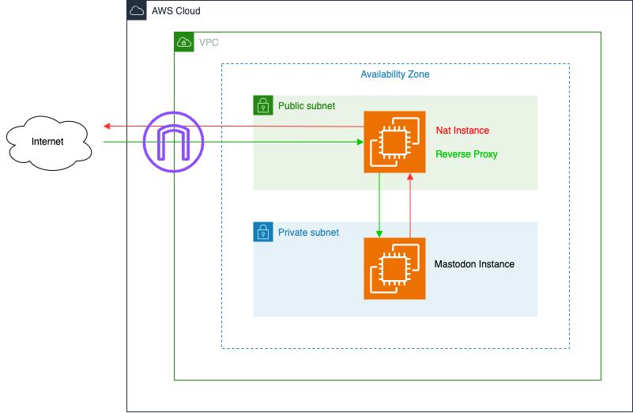

# iMichka's Mastodon Infrastructure

This repo contains the terraform infrastructure and the code to run my own mastodon instance, hosted at http://mastodon.imichka.me.

Mastodon is free and open-source software for running self-hosted social networking services: https://joinmastodon.org/en

I made some important design choices while creating the architecture of this projet.
I had two goals in mind: my AWS bill should be as low as possible, and I wanted to learn new things.

Right now the cost are below 22$/month (domain name excluded): I still need to setup an AWS saving plan to reduce costs even more.

This is my own instance, so I do not need to scale it, and if there is some downtime, it is not a big deal.
Do not use this code in production if you need to scale your instance or need extra security.

Though I tried my best to respect some basic cybersecurity principles, but I do not guarantee anything.

- I wanted to keep mastodon running in a non-routable private subnet, as this is a good practice, and let network traffic go through a NAT Gateway / Application Load Balancer
	- The AWS NAT Gateway is way too expensive for this project. I replaced it with my own NAT instance, using a t2.nano EC2 machine
	- The AWS Application Load Balancer is way too expensive for this project. I have created my own reverse proxy using nginx on a t2.nano EC2 machine
	- To keep costs low, I installed the reverse proxy on the same EC2 as the NAT instance

- The whole mastodon stack runs on a single EC2 instance (webserver, postgresql, ...)
	- I did not want to use RDS for the database, as it is too expensive for this project
	- I considered running mastodon in docker, either on ECS or EKS: too expensive
	- I might add elasticsearch for fun on the EC2, but right now it is not implemented
	- The whole stack is deployed through ansible on the EC2 machines

- There is no preproduction environment right now, but I could add one if necessary later on
- No multi zone redundancy, no autoscaling: everything is a single point of failure: I do not care about downtimes
- No extra monitoring tools: standard Cloudwatch is enough
- No WAF, no DDOS protection: I can still add it later, but it is expensive, and I do not feel I need it right now
- The domain name was bought through route 53: it was easier for me to integrate into the AWS ecosystem. It is probably the most expensive part of the infrastructure ...
- Storage is done on S3, that's the only "standard" thing I have implemented
- Backups are done with a cron job on the EC2 and copied over to S3
- Certificates are delivered by Let's Encrypt

## Architecture

## Why did I start this silly project?

- I became a manager in 2022, after 10 years of being a developer, so I wanted to keep coding (even though I'm also still working a lot on https://github.com/Homebrew/)
- I worked with Azure for 4 years, and wanted to try out AWS (my current company is moving to AWS so this made sense too)
- I wanted to give ansible a try
- I wanted to move out of X/Twitter (because of Elon Musk)

## Why hosting my own instace?

Freedom

## Why self-hosting?

I had some free time while travelling alone for work beginning of 2023 for two weeks.

I considered using a mastodon hosting platform, but that did not sound fun enough.

## What was the hardest part of the projet?

Configuring the nat instance an the reverse proxy. This took me forever.

Setting up the ansible script for mastodon was also a pain (it's based on the mastodon documentation)

I think all in all, it took me more than 100 hours of work to release into production.

## Future plans

- Add encryption between the mastodon EC2 and the reverse proxy
- Setup a saving plan to reduce costs
- Serve media through a subdomain and add a nginx cache instead of serving through S3 directly (to reduce costs in case of traffic increase, and make the urls backend agnostic)

## Running ansible

ansible-playbook -v -i “localhost,” test.yaml

## Checking ngingx logs

sudo less /var/log/nginx/error.log
sudo less /var/log/nginx/access.log

## Getting new certs

Comment out "listen SSL 443" in nginx configuration

sudo certbot --nginx -m <email> --agree-tos --no-eff-email -d mastodon.imichka.me

## Reverse proxy https / http tricks

https://blog.vyvojari.dev/mastodon-behind-a-reverse-proxy-without-ssl-https/

## Emails / SES / SMTP

https://stackoverflow.com/questions/52850212/terraform-aws-ses-credential-resource
